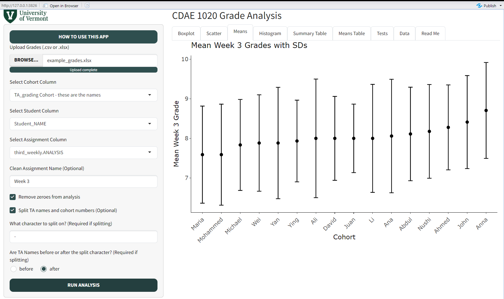

CDAE 1020 Grade Analysis
================
Chris Donovan

August 04, 2024

- [1 Introduction](#1-introduction)
- [2 Getting Started with R and
  Rstudio](#2-getting-started-with-r-and-rstudio)
- [3 Navigating the Project](#3-navigating-the-project)
- [4 The Grade Analysis Shiny App](#4-the-grade-analysis-shiny-app)
- [5 File Structure](#5-file-structure)
- [6 R Resources](#6-r-resources)
- [7 Other Languages Worth Learning](#7-other-languages-worth-learning)
- [8 Contact](#8-contact)

<!-- README.md is generated from README.Rmd. Please edit that file -->

# 1 Introduction

<!-- badges: start -->
<!-- badges: end -->

Welcome to the CDAE 1020 Grade Analysis Project! Ostensibly, the point
of this project is to make your job a little bit easier by giving you
some tools to handle the analysis of grades across cohorts. The Grade
Analysis Shiny App should make it a breeze to get boxplots, means
graphs, and a few statistical tests for a specific assignment across
cohorts. If that’s what you’re here for, head right on down to [The
Grade Analysis Shiny App](#4-the-grade-analysis-shiny-app).

Really though, the point of this project is to gently coax and also less
gently badger you into learning R. R is a free, open source program and
language for data analysis with really broad applications. Everything
from cleaning, recoding, wrangling, imputation, analysis, machine
learning (classification, regression, clustering, neural networks, deep
learning), natural language processing, web scraping, app production,
dashboards, spatial analysis, interactive data visualization, and
probably a lot more can be done in R. It’s really a great skill to pick
up if you plan on doing any kind of quantitative research. It is a skill
that is immensely important but is really not taught in the program. R
is most popular in academia, particularly in ecology and quantitative
psychology, but can be used in all fields and in the private sector as
well.

The crash course that I’ve included here has pretty specific goals.
There are already tons of excellent, free resources you can use to get
started with R. I’ve listed many of them below. I will not attempt to do
a better job at teaching you R than they can and honestly I’d recommend
you start there. What I have done here is aggregate all the scraps of R
wisdom, tips, and tricks I’ve learned over the years that are either not
made explicit in learning materials or are scattered in bits and pieces
across those resources. I focus on R project management, file
structures, importing and saving data, and shortcuts. I also do this
within the scripting environment itself, so you can learn by doing.

I won’t make any claims of this being a comprehensive way to learn R.
However, I do hope that it will:

- Provide a valuable complement to more comprehensive resources.
- Address some sticky or confusing topics that I struggled with when I
  learned R.
- Introduce some immensely helpful topics that I wish someone told me
  about years ago.
- Provide some context and direction to help you navigate your way
  through learning R with established resources.

Here’s what you’ll find in this project:

- A crash course in R that should teach you some of the basics of
  wrangling, analysis, and visualization.
- Slightly more hands-off examples of how to analyze and visualize
  grades in CDAE 1020, including a template for sharing results with a
  markdown.
- A function that I’ve written that makes analyzing grades a breeze,
  with gratuitous instructions on how to use it.
- A Shiny App that will make it a easy to analyze grades even if you
  don’t want to learn to code.
- A heap of resources for learning more about R if you’re interested.

Keep reading below for instructions on how to get started.

# 2 Getting Started with R and Rstudio

To get started using R, you will have to download both R (the program
and language) as well as RStudio (the Integrated Development Environment
or “IDE”). Both can be downloaded from the [Posit
website](https://posit.co/downloads/). Once you have them set up, you
will only need to interact with RStudio. Opening RStudio will
automatically run your latest version of R. About 105% of people who use
R use it through RStudio. It provides a silly amount of features and
quality of life improvements. When you get into the swing of things you
might find times you want to use other IDEs like VSCode for R. But
RStudio is pretty fucking great.

# 3 Navigating the Project

All the files in this directory are related as an R project. This is
very useful because 1) it automatically sets the default working drive
to this root directory, letting us navigate between the scripts and data
that it contains, and 2) it will load project settings that can
establish some convenient default behaviors for us and improve our
quality of life.

The first thing to do to get started will be to open the
`cdae1020_grade_analysis.Rproj` file. That will open the R Project.
Otherwise, if you open a script before first opening the project file,
you will just open that file in isolation and it will not be connected
to the project. After opening the .Rproj file, open
`table_of_contents.R` in the root directory, which lists all the
relevant scripts in the project in the order they should be run. There
is also more information here to orient you to RStudio. From there, you
can navigate to any script either by putting the cursor on the file path
and hitting `F2` (Definition) or by mousing over to it and hitting
`CTRL/CMD + Left Click` on the path itself to open the file. The table
of contents will take you through a crash course in R and hopefully get
you analyzing grades in a jiff.

# 4 The Grade Analysis Shiny App

The Grade Analysis Shiny App a mostly code-free way to upload grades and
get quick and interactive graphs, summary statistics, and a few
statistical tests. Here is a screenshot of what it looks like using some
simulated data:



Shiny Apps are generally deployed on a server and easy to connect to,
but I chose not to deploy this app publicly because I don’t really
understand how cyber security works and don’t want to put student grades
on the internet outside of a controlled environment. So, to access the
app, you just have to make sure the RShiny app is installed just open up
the R console and run:

``` r
# install.packages('shiny')
shiny::runGitHub('ChrisDonovan307/grade_analysis_app')
```

Inside the app, use the green “How to use this app” button in the top
left for more specific instructions. There is also a file of simulated
data to test it out on in the app_files directory. That’s it!

# 5 File Structure

I’ve included an example of what a file structure might look like in an
R project. You can check out the file structure in the `Files` pane in
the bottom-right corner of the Rstudio IDE.

- `1_raw/` is for raw, untouched, datasets. It is good practice to avoid
  editing a raw data file. Instead, when you clean data, put the new,
  clean copy into a new directory. Consider including metadata here in
  the event that you have to look back at the project in two years for
  some absurd but inevitable reason.
- `2_clean/` is for cleaned (wrangled, recoded, imputed, etc.) data.
- `3_functions/` is where custom functions should be stored. A general
  rule of thumb is that if you have to copy and paste code once, that’s
  okay. But if you have the same code in three places, turn it into a
  function instead.
- `4_scripts/` is where most R scripts live. It is probably worth
  keeping some subfolders here if the project becomes large.
- `5_results/` is for any `.rds` or other objects that are worth
  keeping. `.rds` is R’s native way to store a dat file. By the way, if
  you like something, then it is best practice to put a ring on it and
  save it as an `.rds` so you don’t have to figure out how to recreate
  it later.
- `6_markdowns/` is where markdowns live. Markdowns are a very nice way
  of mixing text, code, and outputs, with lots of options for formatting
  and interactive graphs or plots. This README is a markdown.

Other folders I like to include but don’t have in this project are for
tabular outputs, plots, and a graveyard where I can throw old scripts or
objects that I probably won’t need again (but what if I need them again
later?).

Other files in the project:

- `.gitignore` tells Git not to track certain files or directories.
- `.Rhistory` is the log of commands during the session.
- `.Rprofile` runs automatically every time the project is opened.
- `LICENSE` is about as it sounds.
- `README.md` is the document you’re reading right now, while
  `README.Rmd` is the markdown file that renders the document. We edit
  the `.Rmd` file, which then creates the `.md` file.

# 6 R Resources

If you’re interesting in learning more about R, great! You should. For
starters, get set up with [DataCamp](www.datacamp.com). It’s probably
the best interactive, self-paced coding class I’ve seen. There is some
serious depth and breadth of topics here in all sorts of languages and
programs, including Python, Shell, Git, Tableau, and all sorts of other
fun things. It is not free, but even though it’s well worth the price,
you can get access for free. Or rather, any professor at UVM can get you
access for free. Professors can set up an account for free and give
access to as many people as they like. Ask your advisor to give you
access!

DataCamp is an excellent resource to learn the syntax of and get
familiar common packages. However, working in the sterile environment of
the DataCamp courses is not the same as being let loose into the wilds
with R. One resource that bridges that gap (that I haven’t actually
tried but have heard good things about) is the
[Swirl](https://swirlstats.com/) package, that helps you learn R from
within R.

But really, once you start diving into a topic to any depth, you will
find that the best, most detailed, and most up to date resources are
vignettes and bookdowns. You can explore vignettes for a particular
package by throwing `browseVignettes(package = 'whatever_package')` into
the console. As for books, I’ve included a list here of all the most
useful resources I’ve come across.

**Beginner Resources:**

- [R for Data Science](https://r4ds.hadley.nz/) Great resource to start
  out with. Written by Hadley Wickham, author of the Tidyverse.
- [Modern Data Visualization with
  R](https://rkabacoff.github.io/datavis/)
- [Tidyverse Style Guide](https://style.tidyverse.org/index.html).
  Adopting a consistent coding style is a shockingly worthwhile
  investment. It will help make your code more interpretable to others
  (and future you).
- [An Introduction to R](https://rstudio.github.io/r-manuals/r-intro/)
- [The R Manuals](https://cran.r-project.org/manuals.html). These are
  not thrilling, but incredibly helpful to skim through at least.
- [Introduction to Econometrics with
  R](https://www.econometrics-with-r.org/index.html)
- [Multivariate Statistics and Methodology in
  R](https://uoepsy.github.io/msmr/2324/labs/). This is an entire
  semester-long graduate level course that covers PCA, EFA, CFA, and
  SEM.

**Intermediate Resources:**

- [What They Forgot to Teach You About R](https://rstats.wtf/). I
  couldn’t recommend this one enough. It is short, and doesn’t even seem
  to be finished, but it has some real gems that I wished I learned
  earlier.
- [Let’s Git Started](https://happygitwithr.com/). This is a guide to
  Git for R users specifically. Another great resource I wish I found
  years ago.
- [R Markdown: The Definitive
  Guide](https://bookdown.org/yihui/rmarkdown/). Markdowns are a great
  way to make your outputs accessible and make yourself look fancy af.
- [R Markdown Cookbook](https://bookdown.org/yihui/rmarkdown-cookbook/)
- [RStudio IDE User Guide](https://docs.posit.co/ide/user/)
- [R Programming for Data
  Science](https://bookdown.org/rdpeng/rprogdatascience/)
- [Stargazer
  Cheatsheet](https://www.jakeruss.com/cheatsheets/stargazer/).
  Stargazer is a popular package for converting tables and statistical
  outputs into LaTeX.
- [Using the flextable R
  Package](https://ardata-fr.github.io/flextable-book/index.html). This
  is quite a nice package for building and formatting tables. It is the
  best way I’ve found to save tables or images directly to `.docx`
  files. Pretty convenient.
- [A lavaan Compendium for Structural Equation Modeling in Educational
  Research](https://tdjorgensen.github.io/SEM-in-Ed-compendium/index.html).
  Probably the single best R-specific resource on SEM that I’ve come
  across.

**Advanced Resources:**

- [Efficient R Programming](https://csgillespie.github.io/efficientR/)
- [Advanced R](https://adv-r.hadley.nz/index.html)
- [R Packages](https://r-pkgs.org/)
- [Interactive Web-Based Data Visualization with R, plotly, and
  shiny](https://plotly-r.com/index.html)
- [APIs for Social
  Scientists](https://bookdown.org/paul/apis_for_social_scientists/)
- [Engineering Production Grade Shiny
  Apps](https://engineering-shiny.org/)
- [Mastering Shiny](https://mastering-shiny.org/index.html)

**Spatial Analysis:**

- [Spatial Data Science](https://r-spatial.org/book/). Excellent
  resource for the sf and stars package for spatial analysis.
- [R as GIS for
  Economists](https://tmieno2.github.io/R-as-GIS-for-Economists/)
- [Spatial Data Science with R and
  terra](https://rspatial.org/index.html)
- [Geocomputation with R](https://r.geocompx.org/)
- [Package
  rnaturalearth](https://ropensci.r-universe.dev/rnaturalearth/doc/manual.html#check_data_exist).
  Just a help index for the rnaturalearth package. This is the most
  convenient package I’ve found for spatial data for countries and
  states.

# 7 Other Languages Worth Learning

If you’re not into R but do want to get into scripting for analysis, the
two other options I would recommend are Python and Stata. Mostly Python.
Python is a free, open source, high-level general purpose programming
language, which means that it can do just about anything. Everything
that R can do and more, including large language models, software
development, game design, etc. It is immensely popular in data science,
particularly in the private sector. It is also one of the more
human-interpretable languages out there, and is considered one of the
easier languages to learn. Did I mention that it can do literally
anything?

Stata is another good option that is popular among economists. Honestly,
I don’t see any reason to go with Stata over R or Python. It is a
paywalled, black box program, and I’m not aware of any particular thing
that it can do that R or Python can’t do. Still, it has lots of
pertinent, well documented functions for econometrics and the syntax is
quite intuitive. You can also get access for free as a UVM student.

Any of these three are worth learning to make your analyses
reproducible. If you’re having a hard time deciding which one to pick
up, keep in mind that 1) a lot of it comes down to what your advisor /
lab group / field uses. You will need to be using the same language to
collaborate, even if it isn’t the best one. And 2) if you get the
quantitative bug and decide to dive into coding, you will inevitably end
up learning several languages. So, don’t worry too much about whether
you’re starting with the right one!

# 8 Contact

If you’d like to reach out to me with issues or suggestions about the
project, or about anything R related, or about anything else, feel free
to email me at <christopher.donovan@uvm.edu>.
